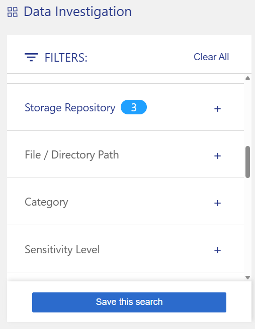
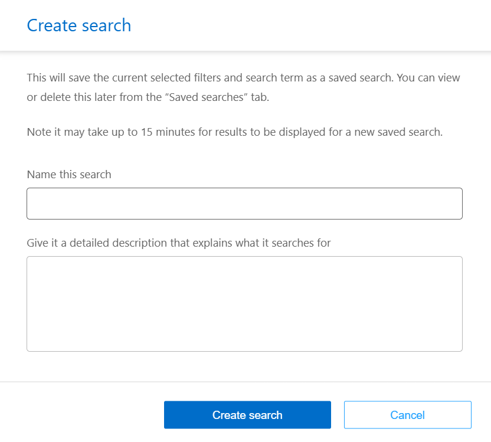

.Steps
. In the Investigation tab, define a search by selecting the filters you want to use. See link:task-investigate-data.html[Filtering data in the Investigation page] for details.

. Once you have all the filter characteristics set to your liking, select *Save query*.
+

. Name the saved query and add a description. The name must be unique. 
. You can optionally save the query as policy:
.. To save the query as a policy, switch the *Run as a policy* toggle. 
.. Choose to *Delete permanently* or *Send email updates*. If you choose email updates, you can email the query results to _all_ Console users at daily, weekly, or monthly. Alternately, you can send the notification to specific email address at the same frequencies. 
. Select *Save*.
+

Once you've created the search or policy, you can view it in the **Saved queries** tab. 